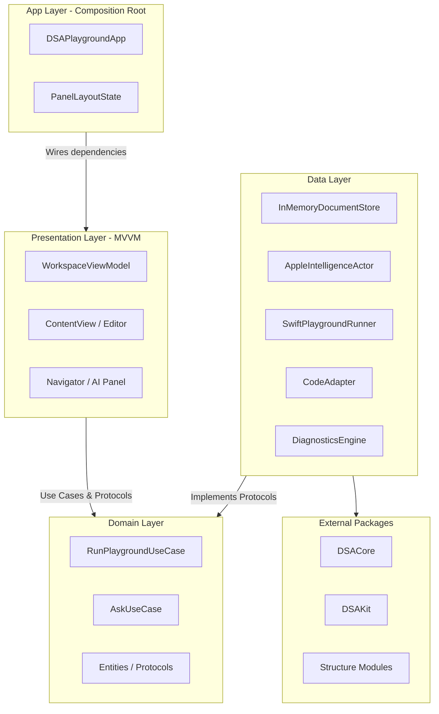
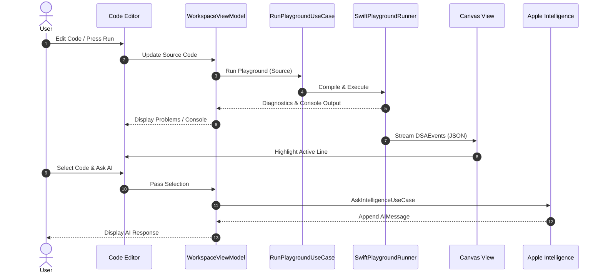

# Architecture

DSA Playground’s host app is organized with **Clean Architecture** boundaries and an **MVVM** presentation layer. DSA visualization modules remain isolated Swift packages under `Packages/`.

## Layer overview

## Domain

| Type | Role |
|------|------|
| `EditorDocument`, `CodeDiagnostic`, `FoldRegion`, `ModuleWorkspace` | Editor models |
| `AIMessage` | Chat turns for the right panel |
| `NavigatorNode` / `NavigatorFile` | Explorer tree |
| `PlaygroundRunState` | Compile/run lifecycle |
| `DocumentStoring`, `PlaygroundRunning`, `IntelligenceGenerating` | Ports |
| `RunPlaygroundUseCase` | Full-file and selection runs |
| `AskIntelligenceUseCase` | Selection Q&A |

Domain types are UI-agnostic. Use cases depend only on protocols.

## Data

| Type | Role |
|------|------|
| `InMemoryDocumentStore` | Per-DSA file workspaces (thread-safe) |
| `AppleIntelligenceActor` | Off-main-actor explain/answer work |
| `AppleIntelligenceGenerator` | MainActor façade + Combine publishers (`IntelligenceGenerating`) |
| `SwiftPlaygroundRunner` | `swiftc` + process I/O (`PlaygroundRunning`) |
| `CodeAdapter` | Paste → DSAKit adaptation |
| `DiagnosticsEngine` | Heuristic + compiler diagnostics |

### Actors

- **`AppleIntelligenceActor`** — Foundation Models / local tutor explanation without blocking the UI.
- Process compile/run remains coordinated on the main actor via `SwiftPlaygroundRunner`, with async `run` and pipe handlers hopping back to `@MainActor`.

### Combine

- `SwiftPlaygroundRunner.statePublisher` / `consolePublisher`
- `AppleIntelligenceGenerator.isGeneratingPublisher`

`WorkspaceViewModel` subscribes so status UI stays in sync with `@Observable` state.

## Presentation (MVVM)

| Piece | Role |
|-------|------|
| **Model** | Domain entities + DSA events from packages |
| **ViewModel** | `WorkspaceViewModel` (`typealias PlaygroundSession`) |
| **View** | SwiftUI panes + AppKit `CodeEditorView` / `PlaygroundTextView` |

Responsibilities of `WorkspaceViewModel`:

- Selected DSA module and per-module documents
- Editor caret / selection
- Run / stop / selection-run
- Diagnostics scheduling
- AI conversation (`aiMessages`)
- Visualizer event playback queue

Views bind with `@Bindable` / `@ObservedObject` and never talk to `swiftc` or Foundation Models directly.

## App composition root

`DSAPlaygroundApp` builds a `DSAModuleRegistry` (Array, Linked List, Stack, Queue, Hash Table, Heap, Tree), constructs `WorkspaceViewModel`, and owns `PanelLayoutState` for pane visibility and sizing.

## Runtime data flow

## Package boundary

Visualizer modules implement `DSAModule` / `DSAVisualizer` from **DSACore**. Student code links **DSAKit** sources copied into the temp compile directory. Adding a structure means a new package + registry entry — the host architecture does not change.
