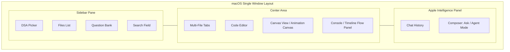

# Features

## Application layout

The interface is structured in a single-window workspace with split panes to make learning, writing, and animating code seamless:

## DSA file navigator

- Top **DSA picker** switches the active structure (Array, Linked List, Stack, Queue, Hash Table, Heap, Tree)
- **Files** section lists that module’s playground files (`main.swift`, helpers, question tabs)
- **Question Bank** section: searchable classic interview prompts per DSA (6 each) — each question is a bundled JSON file under `QuestionBank/{module}/{id}.json` (description + Swift code); the list shows the full description; open as a new editor tab; **Run** executes the active tab
- Question search field sits at the **bottom** of the Explorer
- Files are **persisted per DSA** — switching modules keeps each structure’s editors
- Entrypoint files show a star; selecting a file opens it in the tab bar and switches the active module/canvas

## Multi-file tab bar

- Open several Swift files per DSA
- `⌘T` new tab, `⌘W` close tab
- Starred / entrypoint `main.swift` is compiled as the program entry
- Breadcrumb: `DSAPlayground > {Module} > {file.swift}`

## Code editor

- Editable monospaced Swift editor (AppKit `NSTextView`)
- **Line numbers** in the gutter (toggle `⌃⌘N`)
- **Focused line highlight** follows the caret
- Stronger highlight for canvas / diagnostic lines; previous & next lines soft-highlight with canvas selection
- Syntax coloring for keywords, types, strings, comments, numbers
- Code folding markers in the gutter (`⌃⌘F`)
- Local completion + optional Apple Intelligence ghost suggestions (`⌃⌘A`)
- Problems panel with Accept fix (`⌃⌘D`, `⌘⌥⏎`)
- Status bar: `Ln / Col`, Spaces, UTF-8, Swift, active module

## Selection actions

- Select lines in the editor to reveal the selection action bar
- **Run Selection** — compile/run just the snippet (with support files)
- **Ask Apple Intelligence** — send selection + question; reply on the right
- Context menu: Run Selection / Ask Apple Intelligence
- Shortcuts: `⌘⌥R` (run selection), `⌘⌥I` (ask)

## Apple Intelligence (right panel)

- Single persistent right column (no popup) for chat
- Composer **mode picker**: **Ask** (explain / clear doubts) and **Agent** (generate Swift into the editor)
- Grounded on built-in DSA docs + module bootstrap / APIs / Question Bank — avoids regenerating duplicate Animated* base code
- Shows selected-code context, conversation history, and composer
- Toolbar sparkles / `⌘⇧I` focuses the panel in Agent mode
- Uses on-device Foundation Models when available; otherwise a local tutor scaffold/explanation

## Canvas View

- Middle pane animates DSA mutations from streamed JSON events
- Step / previous-line / next-line controls rewind or advance the canvas through the event timeline
- Per-step **hint** explains what the current line is doing
- Hover/click structure nodes to auto-update selected, previous, next, and running source lines in the editor
- Animation speed slider
- Detachable editor / Canvas View windows

## Console & tooling

- Bottom console: **Flow** panel (left) shows iteration timeline + hints; output (right) shows compile/runtime text
- Tap a flow step or previous/next line to scrub the canvas to that point
- Paste adapt (`CodeAdapter`) rewrites common APIs to DSAKit
- Auto-run after adapt / generate (toggle)
- Panel show/hide toggles for sidebar, built-ins, editor, canvas, console, AI

## Appearance

- Follows **System Settings → Appearance** (Light, Dark, or Auto)
- Playground chrome, Canvas View surfaces, and editor syntax colors adapt dynamically

## Settings (⌘,)

- macOS Settings window with **General**, **Editor**, **Layout**, and **Intelligence** tabs
- Auto-applies; **Reset to Defaults** restores factory prefs
- Persisted as JSON at `~/Library/Application Support/DSA Playground/settings.json`
- Menu / toolbar toggles and pane sizes stay in sync with the same file

## Clean Architecture / MVVM stack

- Domain entities & use cases
- Data stores, runner, AI actor
- Presentation ViewModels and views
- Combine publishers + Actor-isolated AI work
