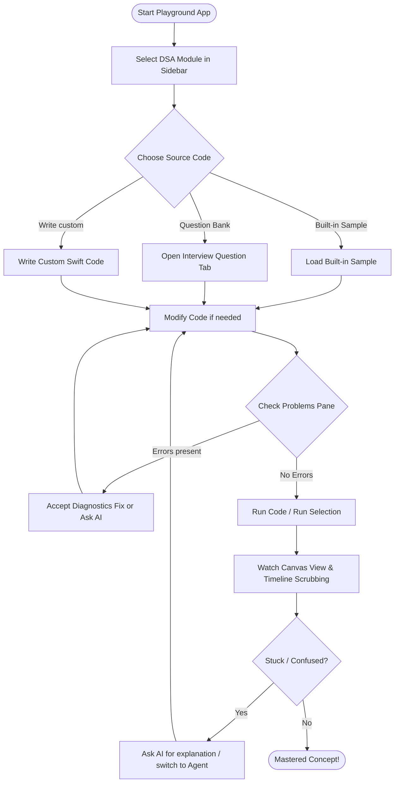

# Usage & user guide

## User journey workflow

Here is the typical step-by-step path when exploring data structures or working on code within the playground:



## First launch

1. Generate and open the Xcode project (`xcodegen generate` → open `DSAPlayground.xcodeproj`).
2. Run the **DSAPlayground** scheme (`⌘R`).
3. You should see four main regions: **Explorer** (left), **Editor**, **Canvas View**, **Apple Intelligence** (right), plus an optional **Console** at the bottom.

## Learn a structure with built-ins

1. In **Explorer**, pick a DSA from the top menu (e.g. Stack).
2. Open a file under **Files**, or search/open a prompt under **Question Bank** (opens as a new tab).
3. Use the **Built-in** chips (Push, Pop, …) for an instant animated demo.
4. Adjust **Speed** in the toolbar if animations are too fast/slow.
5. After **Run**, use Canvas **prev/next** controls or the console **Flow** panel to scrub iterations and read per-step hints.

## Edit and run your own code

1. Edit `main.swift` (and optional helper tabs).
2. Prefer DSAKit types already linked for students:

```swift
var stack = AnimatedStack<Int>()
stack.push(10)
stack.push(20)
_ = stack.pop()
```

3. Press **Run** (`⌘R`) or use the Play toolbar button.
4. Watch **Canvas View**; the editor auto-updates the running, previous, next, and selected source lines when events include line info (or when you click a node).
5. **Stop** (`⌘.`) cancels a running process. **Reset** clears Canvas View.

## Multi-file editing

1. `⌘T` adds a new Swift tab under the **current** DSA.
2. Put helpers in `Helpers.swift` or new files; keep the entry logic in `main.swift`.
3. Switch DSA folders in Explorer — each module keeps its own set of files.

## Run or ask about a selection

1. Drag to select a few lines in the editor.
2. Use the selection bar, context menu, or shortcuts:
   - **Run Selection** (`⌘⌥R`) — runs only that snippet
   - **Ask Apple Intelligence** (`⌘⌥I`) — focuses the right panel in **Ask** mode
3. Or type in the right-panel composer (Ask mode) and press **Ask**.

## Generate a solution

1. Open the right **Apple Intelligence** panel (`⌃⌘6` or toolbar sparkles / `⌘⇧I`).
2. Switch the composer to **Agent** mode.
3. Describe a problem (e.g. “Validate parentheses using a stack”).
4. Press **Generate** — code is inserted into `main.swift` and can auto-run.

## Diagnostics

1. Open the Problems panel (`⌃⌘D`) under the editor.
2. Click a problem to jump/emphasize its line.
3. **Accept** applies an automatic fix when available (`⌘⌥⏎`).

## Layout tips

| Toggle | Shortcut |
|--------|----------|
| Sidebar | `⌃⌘1` |
| Built-in actions | `⌃⌘2` |
| Code editor | `⌃⌘3` |
| Canvas View | `⌃⌘4` |
| Console | `⌃⌘5` |
| Apple Intelligence panel | `⌃⌘6` |
| Reset layout | `⌃⌘0` |

Use each pane’s eye / adjust controls to hide or resize. Editor and Canvas View can open in separate windows (`⌘⇧E` / `⌘⇧V`) and be docked again from the pane header.

## Settings (⌘,)

1. Choose **DSA Playground → Settings…** or press **⌘,**.
2. Use the **General**, **Editor**, **Layout**, and **Intelligence** tabs.
3. Changes apply immediately (no Save button).
4. Preferences are written to  
   `~/Library/Application Support/DSA Playground/settings.json`  
   and reload the next time you open the app.
5. **Reset to Defaults…** restores factory values and rewrites the JSON file.

Toolbar toggles, menu items, and resize handles stay in sync with the same JSON file.

## Shortcut map

| Action | Shortcut |
|--------|----------|
| Settings | `⌘,` |
| Run / Stop | `⌘R` / `⌘.` |
| Run Selection | `⌘⌥R` |
| Ask about Selection | `⌘⌥I` |
| Focus AI panel (Agent) | `⌘⇧I` |
| New / close file tab | `⌘T` / `⌘W` |
| Line numbers / Folding / Problems / AI Complete | `⌃⌘N` / `⌃⌘F` / `⌃⌘D` / `⌃⌘A` |
| Accept diagnostic fix | `⌘⌥⏎` |
| Load sample | `⌘⇧O` |
| Editor / Canvas View new window | `⌘⇧E` / `⌘⇧V` |

## Student API reminder

Use animated types at top level (no `import` needed):

- `AnimatedArray`, `AnimatedLinkedList`, `AnimatedStack`, `AnimatedQueue`
- `AnimatedHashTable`, `AnimatedHeap`, `AnimatedBinaryTree`

See the main [README](../README.md) for more API examples.

## Troubleshooting

| Symptom | What to try |
|---------|-------------|
| Compile errors in console | Fix Swift in Problems / console; ensure only DSAKit APIs |
| AI says unavailable | Enable Apple Intelligence on a supported Mac, or use local tutor replies |
| Code scrolled off-screen | Toggle line numbers off/on; editor pins width to the clip view |
| Wrong Canvas View | Select the matching DSA folder/file in Explorer |
| Selection run fails | Snippet must be valid top-level Swift; include needed setup lines |
