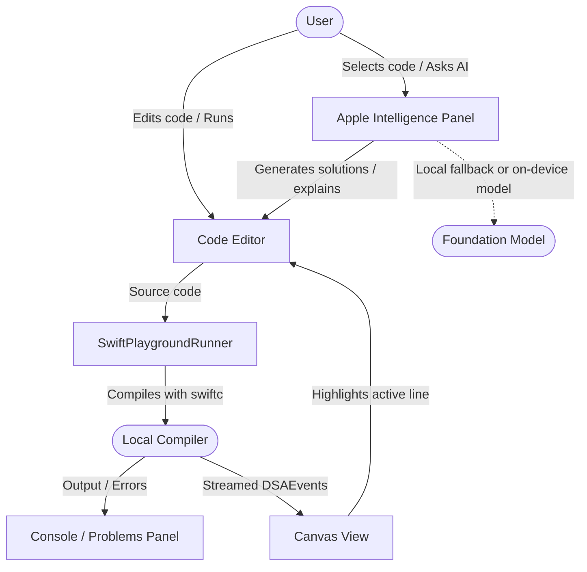

# DSA Playground (macOS)

Interactive Swift playground for learning Data Structures & Algorithms with a Cursor/Xcode-style editor, live visualization, and Apple Intelligence assistance.

**Layout:** DSA file navigator (left) · multi-tab code editor (center) · Canvas View (middle) · Apple Intelligence panel (right) · console (bottom).

**Appearance:** Follows the system Light / Dark / Auto setting (System Settings → Appearance). Editor syntax colors and playground chrome adapt automatically.

**Settings:** Open with **⌘,** (DSA Playground → Settings…). Changes auto-apply and persist to `~/Library/Application Support/DSA Playground/settings.json`. Use **Reset to Defaults** in the Settings window to restore the factory preferences.

## Requirements

- macOS 14+
- Xcode 15+ (or Xcode Command Line Tools with a working `swiftc`)
- App Sandbox is **disabled** so the playground can compile and run student Swift via the local toolchain
- Apple Intelligence explanations require a supported Mac + macOS 26+ when available (local tutor fallback otherwise)

## Quick start

```bash
cd "DSA Playground macOS"
xcodegen generate
open DSAPlayground.xcodeproj
```

In Xcode: select the **DSAPlayground** scheme → Run (`⌘R`).

Or from the terminal:

```bash
xcodebuild -scheme DSAPlayground -project DSAPlayground.xcodeproj \
  -configuration Debug -destination 'platform=macOS' \
  -derivedDataPath ./DerivedData build

open "./DerivedData/Build/Products/Debug/DSA Playground.app"
```

## Documentation

| Document | Contents |
|----------|----------|
| [Docs/ARCHITECTURE.md](Docs/ARCHITECTURE.md) | Clean Architecture layers, data flow, Actors & Combine |
| [Docs/DESIGN_PATTERNS.md](Docs/DESIGN_PATTERNS.md) | MVVM, Registry, Adapter, Observer |
| [Docs/FEATURES.md](Docs/FEATURES.md) | Editor, navigator, AI, Canvas View feature list |
| [Docs/USAGE_AND_USER_GUIDE.md](Docs/USAGE_AND_USER_GUIDE.md) | Step-by-step usage and keyboard shortcuts |

## Architecture (summary)

The host app follows **Clean Architecture** + **MVVM**:

- **Domain** — entities (`EditorDocument`, `AIMessage`, …), protocols, use cases
- **Data** — document store, compile/run runner, `AppleIntelligenceActor`
- **Presentation** — `WorkspaceViewModel` + SwiftUI/AppKit views
- **App** — composition root (`DSAPlaygroundApp`)

DSA structures live as pluggable Swift packages under `Packages/` (`DSACore`, `DSAKit`, `DSAArray`, …).

### System interaction



## Core workflow

1. Open a DSA folder in the **Explorer** (Array, Stack, Queue, …) and select `main.swift` or another file.
2. Edit Swift with **line numbers**, **focused-line highlight**, tabs, and diagnostics.
3. Select lines → **Run Selection** or **Ask Apple Intelligence** (answers appear on the right).
4. Press **Run** (`⌘R`) to compile, stream events, and animate the structure in Canvas View.

## Project layout

```
DSAPlayground/
  App/                 # Composition root, windows, layout state
  Domain/              # Entities, protocols, use cases
  Data/                # Stores, AI actor
  Presentation/        # ViewModels + feature views (navigator, AI)
  Editor/              # AppKit text editor, gutter, diagnostics UI helpers
  Runner/ Adapter/ AI/ # Compile/run, paste adapt, AI façade
Packages/
  DSACore/ DSAKit/ DSAArray/ …   # Pluggable DSA modules
Docs/                  # Architecture & user documentation
project.yml            # XcodeGen definition
```

## Notes

- Compile/runtime errors appear in the bottom console and Problems panel.
- Use the **Speed** slider to pace animations.
- **Load Sample** restores starter code for the selected DSA.
- Student binaries have no network access by design; keep examples self-contained.
